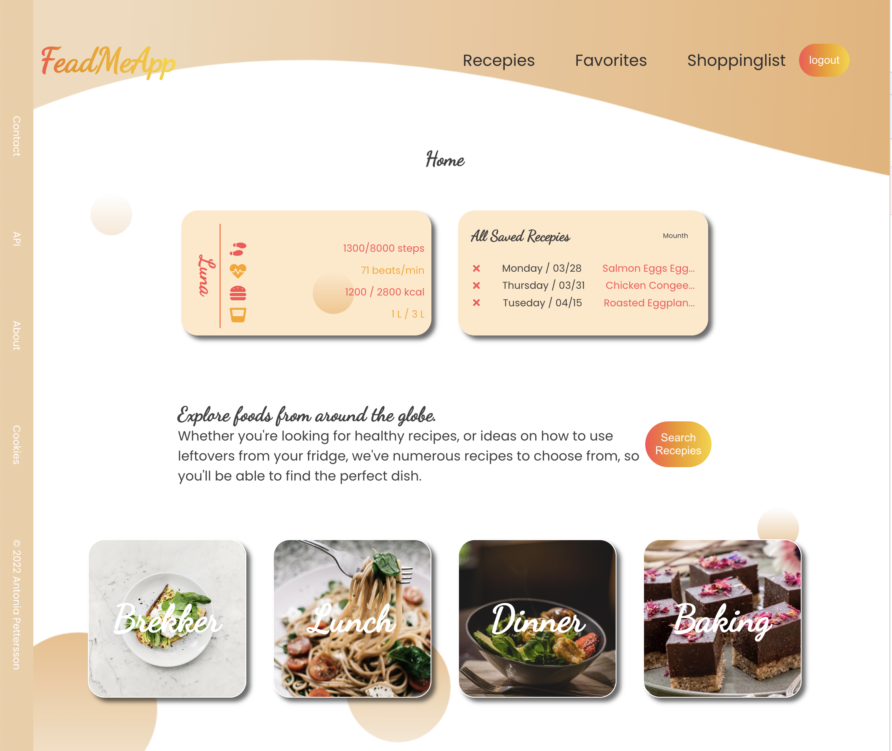

# FeadMeApp

Explore foods from around the globe

 

## Table of contents

- [General info](#general-info)
- [Technologies](#technologies)
- [Setup](#setup)

## General info

<p align="center">
FeadMeApp is a degree project for my education as a Frontend Developer at the Media Institute. The project's frontend is built in React, the backend in Node.js and MySQL. The database is built in PhpMyAdmin. The Backend server is hosting on Heroku and the frontEnd is deployed at githubPages. 
<br>
 Right now I'm using the "themealdb" API to get recipe search results. But I also start collecting my own recipes and build my own API. These recipes are presented under "categories on the Home page". The database with these recipes is currently hard-coded in separate files under the Backend folder
 
</p>

## Technologies

Project is created with:

- react version: "^17.0.2",
- sass version: "^1.49.9",
- expres version: "^4.17.3",
- mysql2 version: "^2.3.3",

## Setup

To run this project, install it locally using npm:

### backend

```
$ cd ./backend
$ npm install
$ heroku restart or  node server.js 
```

### frontend

```
$ cd ./frontend
$ npm install
$ npm run deploy  or npm start
```
